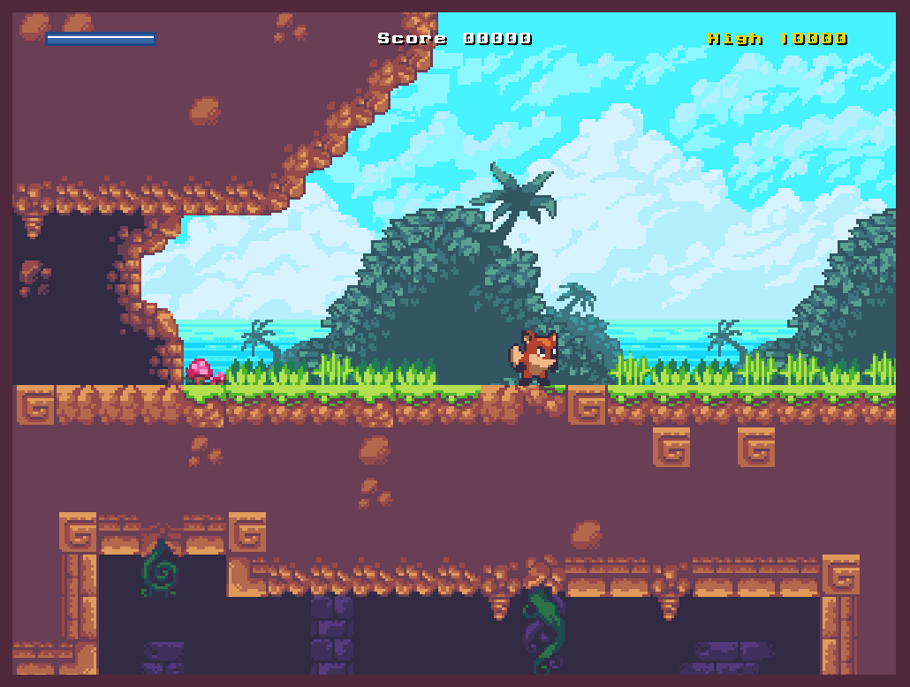
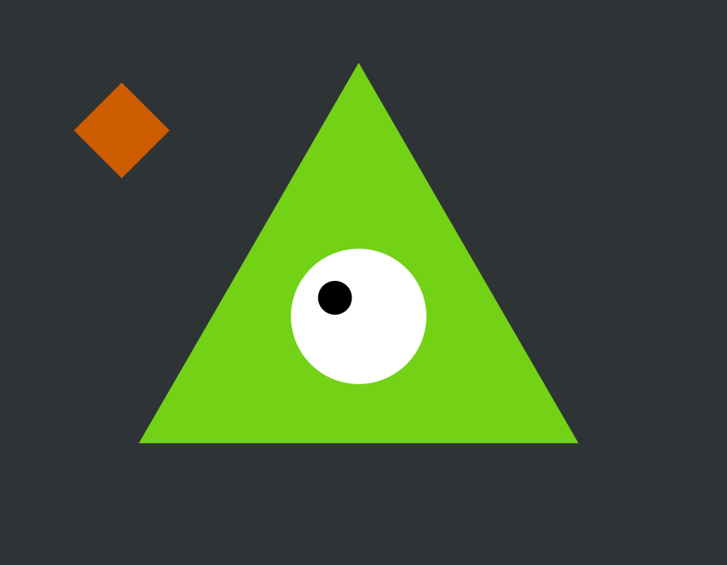

# Making Online Games

## Games

Following is a list of video game programs.
Each game entry links to an online editor to make and test changes to the program code.

### Simple Snake

A simple implementation of the classic snake game. You can control the snake using arrow keys and WASD keys.

+ Program code: [./games-program-codes/simple-snake](./games-program-codes/simple-snake)
+ Online editor: <https://elm-editor.com/?workspace-state=https%3A%2F%2Fgithub.com%2Fonlinegamemaker%2Fmaking-online-games%2Ftree%2Fmain%2Fgames-program-codes%2Fsimple-snake&file-path-to-open=src%2FMain.elm>

### Sunny Land — A WebGL Playground platformer

+ Main repository by [Andrea Peltrin](https://github.com/passiomatic): https://github.com/passiomatic/sunny-land
+ Online editor: <https://elm-editor.com/?workspace-state=https%3A%2F%2Fgithub.com%2FViir%2Fsunny-land%2Ftree%2Fd7660f6e6edf099d8d52587224582f235e0f6a4e%2F&file-path-to-open=src%2FMain.elm>

## Game Template

This project is a template for video games.
It comes with a framework for rendering to HTML (web browsers) and processing inputs from the keyboard or the mouse.
You can use this as a starting point for games like Tic-Tac-Toe, Snake, Tetris, Breakout, or platformers like Super Mario.

+ Program code: [./games-program-codes/game-template](./games-program-codes/game-template)
+ Online editor: <https://elm-editor.com/?workspace-state=https%3A%2F%2Fgithub.com%2Fonlinegamemaker%2Fmaking-online-games%2Ftree%2Fmain%2Fgames-program-codes%2Fgame-template&file-path-to-open=src%2FMain.elm>

## Tech Demos

### Play Audio File

Playing an audio file from the Elm update function without using ports:

+ Program code: [./implement/demo/play-audio-file](./implement/demo/play-audio-file)
+ Online editor: <https://elm-editor.com/?workspace-state=https%3A%2F%2Fgithub.com%2Fonlinegamemaker%2Fmaking-online-games%2Ftree%2Fmain%2Fimplement%2Fdemo%2Fplay-audio-file&file-path-to-open=src%2FMain.elm>

### WebGL Rotating Cube

This demo uses WebGL functions to render a rotating cube.

+ Program code: [./implement/demo/webgl-rotating-cube](./implement/demo/webgl-rotating-cube)
+ Online editor: <https://elm-editor.com/?workspace-state=https%3A%2F%2Fgithub.com%2Fonlinegamemaker%2Fmaking-online-games%2Ftree%2Ffd35d23d89a50014097e64d362f1a991a8af206f%2Fimplement%2Fdemo%2Fwebgl-rotating-cube&file-path-to-open=src%2FMain.elm>

### elm-3d-playground-exploration

+ Program code: <https://github.com/erkal/elm-3d-playground-exploration/tree/022ae72a427ecbf8c9b7bb0e4c608c5d195c2546>
+ Online editor: <https://elm-editor.com/?workspace-state=https%3A%2F%2Fgithub.com%2Ferkal%2Felm-3d-playground-exploration%2Ftree%2F022ae72a427ecbf8c9b7bb0e4c608c5d195c2546%2F>

## Basic Elm

The following examples are not games, but useful to learn the basics of Elm.

### Counter Buttons

+ Program code: <https://github.com/onlinegamemaker/making-online-games/tree/b1c8a121e1df6e7e66a42f70de3de8be683f3501/implement/demo/counter-buttons>
+ Online editor: <https://elm-editor.com/?workspace-state=https%3A%2F%2Fgithub.com%2Fonlinegamemaker%2Fmaking-online-games%2Ftree%2Fmain%2Fimplement%2Fdemo%2Fcounter-buttons&file-path-to-open=src%2FCounterButtonsMain.elm>

### Analog Clock

+ Program code: <https://github.com/onlinegamemaker/making-online-games/tree/b1c8a121e1df6e7e66a42f70de3de8be683f3501/implement/demo/clock-svg>
+ Online editor: <https://elm-editor.com/?workspace-state=https%3A%2F%2Fgithub.com%2Fonlinegamemaker%2Fmaking-online-games%2Ftree%2Fmain%2Fimplement%2Fdemo%2Fclock-svg&file-path-to-open=src%2FMain.elm>
