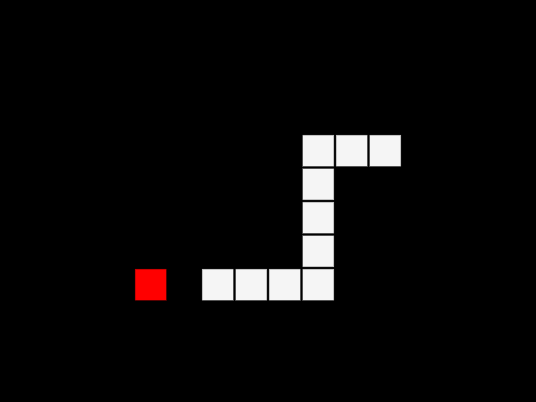

# Simple Snake

A simple implementation of the classic snake game. You can control the snake using arrow keys and WASD keys.

To play the game or modify it, you can open it in the online editor at <https://elm-editor.com/?workspace-state=https%3A%2F%2Fgithub.com%2Fonlinegamemaker%2Fmaking-online-games%2Ftree%2Fmain%2Fgames-program-codes%2Fsimple-snake&file-path-to-open=src%2FMain.elm>
