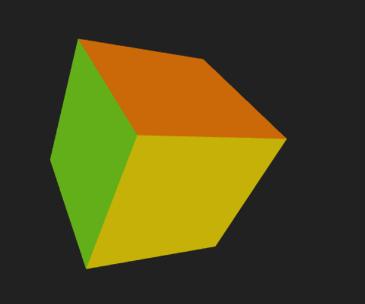

# WebGL Rotating Cube

This demo uses WebGL functions to render a rotating cube.

https://elm-editor.com/?project-state=https%3A%2F%2Fgithub.com%2Fonlinegamemaker%2Fmaking-online-games%2Ftree%2Fmain%2Fimplement%2Fdemo%2Fwebgl-rotating-cube&file-path-to-open=src%2FMain.elm

